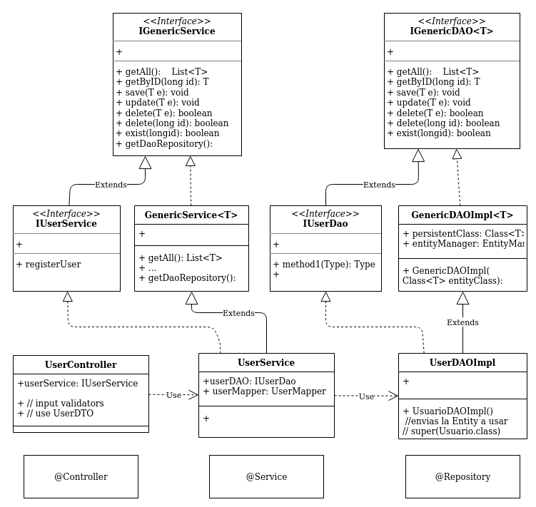

## InventProj

es un proyecto base generico para plataformas web
de administracion para usuarios Roles y permisos en una applicacion web

se encuentra implementado com Maven, Java 11, Spring Framework 5.2.3 en Arquitectura MVC
Hibernate para acceso a BD

buenas practicas Clases Genericas

##### UML

