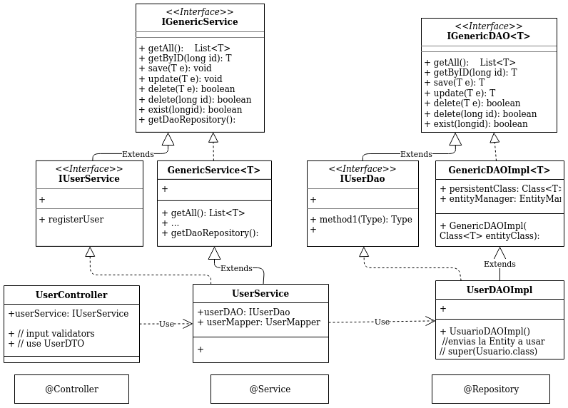

## InventProj

Es un **proyecto base** de plataformas web generica 
lleva implementada la administracion ABM para Usuarios Roles y Permisos
con posibilidad de agregar **Roles personalizados** asignando permisos para proteger y personalizar el acceso a las funciones de la aplicacion web

y una app basica de ejemplo de post-topic

se encuentra implementado con **Maven, Java 11, Spring Framework 5.2.3**
   **Hibernate** para acceso a BD, **manejo de errores y excepciones** por cada capa de la arquitectura MVC de Spring y JSP para front

clases Interfaces clases Genericas y patrones de diseño

##### UML entities 

- La implementacion de entidades se realiza con **JPA Hibernate** 
- Implementa la administracion para 	   **User -> Roles -> Permits**

##### UML spring MVC

-ejemplo de la implementacion de la arquitectura MVC de spring con **User** para **Controller Service y Repository**

la implementacion lleva un DefaultRestController para poder realizar un carga inicial con datos de prueba y poder modificar o agregar para realizar pruebas
